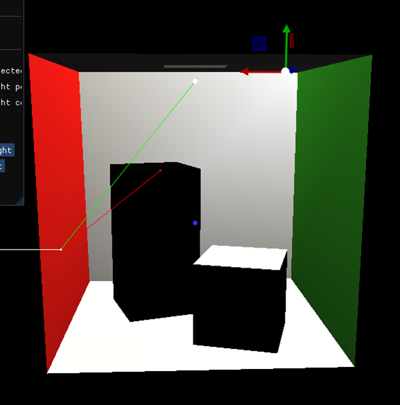
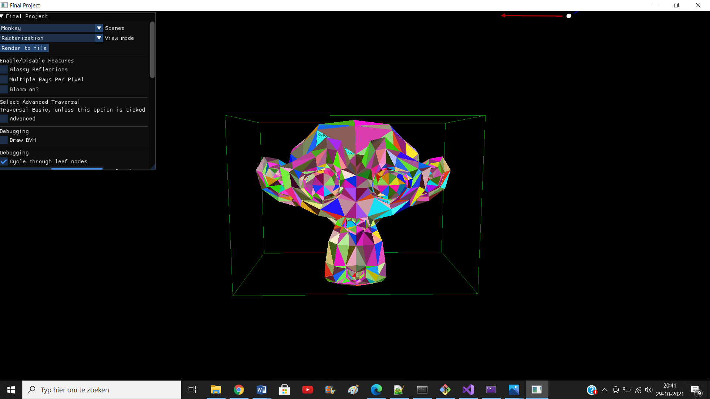
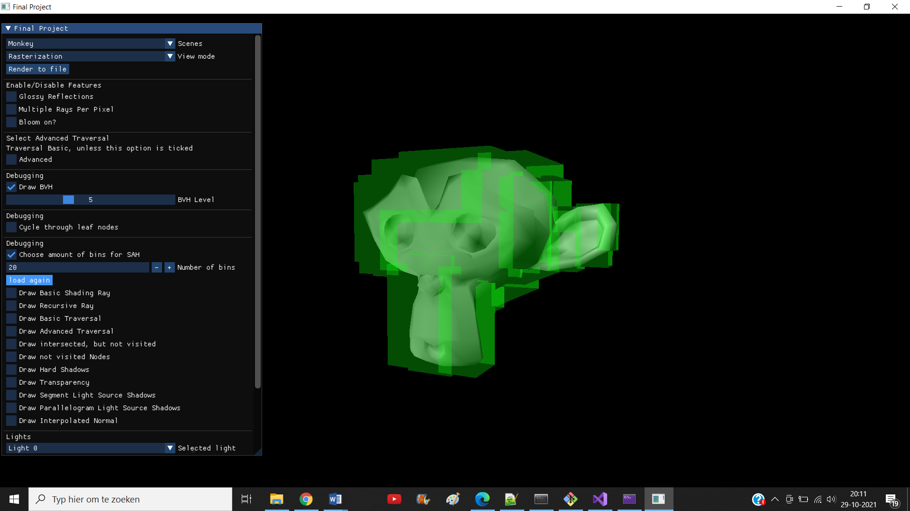
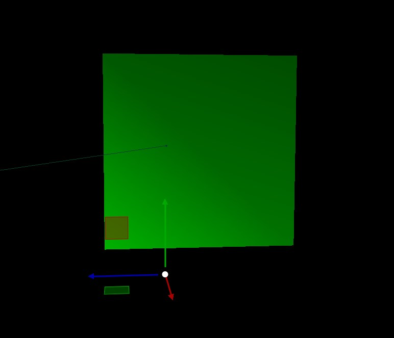

Report

Group 82

**Members:**

- Boleslav Khodakov №5257832
- Bram Stellinga №5287294
- Denis Tsvetkov №5214629

**Basic Features:**

**3.1 Shading and Intersection**

**Description**

*The solution for this task did not require access to any additional resources. Only older assignments (a combination of our solutions for assignment 5) were used for this task.*

We calculate an intersection between the ray and any object. We use the `bvh.intersect()` method to achieve this. `getFinalColor` is made in such a way that it works for all types of light sources. For the sake of readability, I will continue the example under the assumption that we use a point Light. Please keep in mind however, that the segment Light and Parallelogram Light also get looped over in `getFinalColor`.

If there is an intersection, we check which side of the object its normal is facing.

1. In case the normal and the light source are facing the opposite side of the object compared to where the ray hit it, we do not calculate any shading.

2. In case the normal faces one side, but both ray and light source face the other side of the object, we invert the normal (because we know that side must have shading)

3. In case the normal, ray, light source all face the same side, we continue with no inversion required

We use Phong shading to calculate both diffuse and specularity for the hit object. We also make sure to include some new parameters (comp. to ass.3), such as color. We repeat these actions for every (point)Light in the scene.

Several additional methods are called in `getFinalColor`. They are not listed here, since they belong to different features.

**Visual Debug:**

**3.2 Recursive ray-tracer**

**Description**

*The solution for this task did not require access to any additional resources. Only lecture slides (Lecture 8 - Ray Tracing) was used as a reference.*

After looping over all the light sources and calculating Phong shading using said sources, we check two things (we are still within `getFinalColor`):

1. Is the ks of the material of the hit object black (`glm::vec3{0.0f, 0.0f, 0.0f}`)?

2. Is the depth smaller than 8? (this is to avoid infinite loops)

If both conditions hold, we call `getFinalColor` again (recursively). We add the result that we get to our current color. As a result, we get a combination of colors. This effect can be seen well in the third scene, where there is a mirror.

Several additional methods are called in `getFinalColor` and make use of recursion (e.g. transparency). They are not listed here, since they belong to different features.

**Visual Debug:**

**Ray Traced:**

1. 

**3.3 Hard shadows**

**Description:**

From the intersection point (if there is one) between the ray shot from the camera and one of the meshes I shoot a ray towards the point light. If it intersects something then we know it is in shadow, otherwise it reaches the light and is not shadow (so that light source can be used for the Phong shading calculation).

**Rendered Image:**

**Visual debugger:**

Red Ray – the ray towards the light intersects something

Green Ray – the ray towards the light reaches the light

**3.4 Area lights**

**3.4.1 Segment light source**

**Description:**

From the intersection point (if there is one) between the ray shot from the camera and one of the meshes I shoot a sample of random rays towards the segment light. For evaluating the final color for the intersection point we use linear interpolation to calculate the colour at the intersections of the segment light with each of the rays from the sample, we then sum them together and take the average.

The sampling strategy was taken from the book (Chapter 13.4) (and [here](https://en.wikipedia.org/wiki/Jitter) but just for clarifications): we basically generate 1 (or 2 for the parallelogram light source and multiple rays per pixel) samples or random numbers in the interval [0,1]. Then if we took 2 samples we shuffle one of them as shown in the book.
After that, for each number in the sample(s) we generate a new ray and proceed with the feature.
For "true" randomness, we call srand with the current time in milliseconds as input so that the seed is different everytime we want to make a sample.

**Rendered Image (Random sampling (200 samples)):**

**Rendered Image (Regular sampling (201 samples)):**

**Rendered Image (Random sampling (600 samples)):**

**Visual debugger (200 samples):**

White Ray – the ray towards the light intersects something

If the ray reaches the light its colour is the same as the one on the intersection point with the segment

**2 segment light sources using regular sampling with 11 rays**

**3.4.2 Parallelogram light source**

**Description:**

Same idea as Segment light source but instead of sampling on a single line we sample an area (in this case the 2D square).

**Rendered Image (Regular Sampling (441 samples)):**

**Rendered Image (Random Sampling (500 samples)):**

**Rendered Image (Random Sampling (1000 samples)):**

**Visual debugger (121 samples):**

White Ray – the ray towards the light intersects something

If the ray reaches the light its colour is the same as the one on the intersection point with the parallelogram

**3.5 Acceleration data-structure without pointers**

**3.5.1 Acceleration data-structure generation**

We started with creating a Node struct, with four attributes: isLeaf, indices, box and level. Isleaf specifies whether the node is a leaf or not and level is the level of that node in the bvh tree. Indices is a 2D std::vector, such that it can store multiple integers per index, the reason we choose for this is because we wanted to, not only store triangle indices, but also the mesh index (the index in scene->meshes at which a certain mesh can be found), this made the most sense to us because we are now able to treat the whole scene as one object. Then we have the box, which is the axis aligned boundary box of a node, this box will wrap exactly around all triangles inside this node.
We then created a recursive method named buildBVH, which recursively creates a binary tree where each leaf node contains the indices of one or more triangles, and when a node is not a leaf, it contains the indices of its children.
We also created other helper methods, for example getBox(), that computes the lowest and highest values of all coordinates of all triangles given to this method, and returns it into an AABB.
We also use the std::sort method with a self made comparator. This comparator takes two vectors of integers, with for each vector, the first value corresponding to the mesh index, and the second value to the triangle index. This comparator computes of both triangles the centroid, and compares them on alternating axes. This comparator is then used in the std::sort method to make sure that the list of indices of each node is sorted properly, such that the median value of this list can easily be taken, which is what happens in the buildBVH method. 

For the first visual debug feature, I draw all boxes per level, see here the dragon axis aligned boxes for levels 0, 4 and 17:

For the second visual debug feature, I made a slider in the gui that allows you to cycle through all leaf nodes and view all triangles inside that leaf in a different color.

Each of the four images here shows one of the leaf nodes with its containing triangles in different colors, for a maximum level limit of 0, 2, 8 and 10 respectively. This visual debug feature is a really good way to verify if the creation of the bvh worked as intended. Note that there is a small epsilon value added to make sure every triangle was going to be visible, to account for triangles pointing away from us, I also drew each triangle again with the epsilon subtracted.

**3.5.2 Acceleration data-structure traversal**

**Description**

*The solution for this task did not require access to any additional resources.*

There original `intersect` method inside `bounding_volume_hierarchy.cpp` is only used to choose for either the basic or advanced traversal.

*Basic traversal*:

We start with a node (root in our case). We check if the node’s AABB is hit by the ray. IIf it is, we check if the node is a leaf node. If it is, we access all meshes that it has and build any triangles that it has. We stop the traversal after having drawn all the triangles.

If it is not a leaf node, we recursively access the children and repeat the process from the beginning (until we run out of nodes).

**Note on extra checkbox**: There are two checkboxes, one called "Draw intersected, but not visited", the other called "Draw not visited nodes". "Draw intersected, but not visited" is the one which satisfies condition "Create an option to draw the intersected but not visited nodes with another color". "Draw not visited nodes" is an extra debug checkbox I made myself for drawing any not visited nodes.

**Notes on visual debugger**: There are two checkboxes for basic traversal. One corresponds to the condition "Create an option to draw the intersected but not visited nodes with another color". The other corresponds to condition "When performing recursive ray-tracing, visualize each recursion at a time". I decided to make them distinct, since they would otherwise interfere with each other.

**Basic visual debug:**

**Ray traced:**

*Advanced traversal*:
This has been done per the suggestion of a Teaching Assistant. I was later told by another teaching assistants that this method is not the most optimal, however I decided to stick with it as it worked.

Instead of looping through the nodes on a parent-child basis, we first go over all the nodes present in the BVH. We instantly discard any nodes that are not leaf nodes. For the remaining nodes, we calculate their AABB’s distances to the ray's origin and put them in a ascending priority queue.
We pop from the priority queue. For the first node, we check if it is empty. If it is not, we access its related meshes and draw any triangles inside that node.

Otherwise, if the leaf node was empty, we pop the queue again and check for emptiness again. This is repeated until we either draw a non-empty leaf node or run out of nodes in the priority queue.

*please note: The teammate responsible for the generation of the BVH has only found out about `maximum number of levels of your hierarchy` several days before the deadline. Before that we only had one triangle per leaf node. Thus I had to adjust my traversal quickly. I would kindly ask the examiner of this material to keep that in mind, whenever they are reviewing BVH related code.*

**Note on feature**: this feature has to be toggled in the GUI.

**Note on extra checkbox**: There are two checkboxes, one called "Draw intersected, but not visited", the other called "Draw not visited nodes". "Draw intersected, but not visited" is the one which satisfies condition "Create an option to draw the intersected but not visited nodes with another color". "Draw not visited nodes" is an extra debug checkbox I made myself for drawing any not visited nodes.

**Notes on visual debugger**: To be able to see this visual debugger, you will first have to toggle "Advanced" (= advanced traversal) in the GUI. Then you can toggle visual debuggers for this feature. I have not implemented the following condition "Create an option to draw the intersected but not visited nodes with another color" for the advanced traversal, because I visit all leaf nodes I access (even if they're empty). Hence nothing would be drawn.

**Visual Debugger:**

**Ray traced:**

**3.6 Barycentric coordinates for normal interpolation**

**Description**

For the intersection point instead of using the plane normal to compute the Phong shading, we calculate the interpolated normal: when we find the triangle that the intersection point is in, we take the 3 vertex normals and using the barycentric coordinates we weight each of them and we sum them together. The result is the interpolated normal, which allows for the shading to appear as it would for a true curved surface.
Sources: [this](https://en.wikipedia.org/wiki/Vertex_normal), [this](http://web.missouri.edu/~duanye/course/cs4610-spring-2017/assignment/ComputeVertexNormal.pdf) and [this](https://en.wikipedia.org/wiki/Phong_shading)

**Rendered Image**

**Rendered Image (with hard shadows)**

**Visual Debugger**

Green Ray- vertex normals

Blue Ray - plane normal

Red Ray - interpolated normal

**3.7 Textures**

For the texture feature, I checked if a material that is hit by a ray, has a KdTexture value or not, if not, nothing happens. If it does, we first compute the barycentric coordinates of this point regarding to its triangle vertices. After this, we compute the texture coordinate of this point, by multiplying each vertex texture coordinate by the corresponding barycentric value, and add them all three together.
After this we made the getTexel method in image.cpp, such that it maps each texture coordinate to the right image pixel, which is what we return. This value is then used instead of the kd value in diffuseOnly().

For the visual debug feature, I created a custom object, a quad, and gave it a 2x2 texture:

**Extra Features**

**2. SAH+binning as splitting criterion for BVH**

**Description**

I copied the buildBVH method and changed it for the splitting criterion. For each node, it computes the SAH cost, at each bin's border and that for all three axes. The option with the lowest SAH cost will be the one this method chooses, and then it continues recursively.
When calculating the SAH cost, we only looked at the surface area and the amount of triangles that would go into that node, because the other components of this function will be the same of each node.
Also, in some cases it may happen that all triangles will go into one node, and no triangles into the other, in this case I decided to not split, and make the current node a leaf node with all triangles in it.

For the visual debug of this feature, I made a checkbox where we can specify the amount of bins to use, after this, there appears a button that reloads the scene such that it builds the SAH tree again with the chosen number of bins used.
The following three images show the Monkey scene, the bvh is created with SAH and it uses 2, 4, 20, 60 and 170 bins respectively, all drawn for level 5 and a maximum depth at 1000:

Looking at these images you can see that the higher the amount of bins used, the less empty space is used, this is because there are alot more options to split, the chance of finding one with a lower cost (and thus less empty space) is definitely there.

**4. Bloom**

**Description**

*The solution for this task did not require access to any additional resources. Only lecture slides (Lecture 2 - Images and Algebra) was used as a reference.*

The core concept of bloom is to create a sort of "extra specularity" around spots on the image, where the colors are very intense. Bloom is a post-processing feature. I call that feature in the `#endif` of the `renderRayTracing` method. That means that I use the original rendered image as a basis for my bloom. To make bloom work, I also copied the way that `screen` stores pixels. I have a custom `setBloom` method that is an adjusted copy of `setPixel` and allows me to store a second image of the same screen.

When `bloom` gets called, it goes through every pixel of the (original) image and checks if that pixel has any color whose intensity is larger than the threshold (set at 0.65f). If it is, we save that to the second image via `setBloom` . If none of the colors are intense, we save a `glm::vec3{0.0f,0.0f,0.0f}` via `setBloom` instead. We thus have a second image stored, where the colors are either intense or pitch black.

We now loop over all pixels of the (original) image again. We apply a box filter to all pixels of the original image by calling the`boxFilter` method.

`boxFilter` loops over a over all the pixels in the range (= filter size * filter size) of the selected pixel. It calculates the average of all those color values (by first summing, then dividing).

Thus, when we have applied our box filter to the second image, it becomes a "ghostly" and foggy version of itself. We then scale the "ghosty" second image and overlay it on top of the original image.

This results in what is known as bloom.

**Note on feature**: this feature has to be toggled in the GUI.

**How the visual debugger works**

The visual debugger has a checkbox in the GUI. The checkbox "Draw Bloom" only appears after the "Bloom On?" checkbox is toggled in features. When "Draw Bloom is checked", a slider will appear. It is initially set to 0. It can be set to either 1 or 2. These are the two stages of bloom. Stage 1 will show the user the second image before applying the box filter. Stage 2 will show the user the second image after applying the box filter. This visual debug is only visible after the correct settings are selected and the mode is set to "ray tracing".

**Visual Debug:**

Stage 1

Stage 2

please note this image is not black, its the "ghosty" effect^

**Ray Traced:**

**7. Multiple rays per pixel**

**Description**

I used the same strategy to generate the sample of rays as with the parallelogram light source. For a given pixel (x, y) I generate 2 * K (K for the width and K for the height) random floats between -0.0005 and 0.0005 (which is the equivalent of half a pixel; half a pixel because otherwise two pixels that are next to each other might end up using the same intersection point to calculate the final colour). Then I use the generated values to take more pixels around the initial one(by adding the numbers to its coordinates) and then for each one I shoot a ray and compute the phong shading at that intersection point (taking into consideration all light sources and the cases where the point might be in shadow), sum all of the colours together, take the average and finally I set the colour of the initial pixel (with the (x, y) coordinates) to that RGB value that I ended up with.

**Rendered Image (50 rays per pixel; 1 segment light source with 200 random samples)**

**Rendered Image (30 rays per pixel; 1 parallelogram light source with 300 random samples + mirror)**

**Visual Debugger (20 samples; the values here are 10 times the actual ones for better visibility)**

White Ray - intersects one of the meshes / shapes 

Red Ray - doesn't intersect anything

**Visual Debugger (20 samples; the values here are the same as actual ones(as you can it looks like all of them end up in the same point))**

**Visual Debugger (not a visual debugger but we can see what the random sample (20 rays) for an arbitrary pixel looks like)**

**8. Glossy Reflections**

**Description**

For this feature I was mostly looking for information in the book (Section 13.4.4), but also [here](https://en.wikipedia.org/wiki/Gloss_(optics)) and [here](https://tel.archives-ouvertes.fr/tel-00326792/file/These_final.pdf) 
(I didn't end up using anything I found there, but they still helped me to make progress on the feature). This is what I did following the book:
Instead of using the "perfect" reflection vector that we used for recursion in 3.2, I decided to create a sample of randomly perturbed vectors (exactly as shown in the book).
Then for each vector, I create a ray in that direction and invoke getFinalColour with that vector. I sum all the colours I get and then take their average. The result is added to the fina colour for that pixel.
According to the book, the glossiness of the reflection was dependent on ***a***, which in our was the shininess of the material. However, it turned out that
using ***a = shininess*** didn't lead to the results I expected because the sample rays were too spread (check visual debugger) and the reflection was a blurry mess (check rendered image).
So I tried different alternatives (check rendered images) such as ***a = 1 / shininess*** and ***a = 0.4 / shininess***. I was satisfied with both results, but in the end 
I opted for ***a = 1 / shininess*** because it was "the best of both words" - it was still blurry, but you could also distinguish the object that was being reflected.

**Rendered Image (11 rays per pixel; 80 perturbed reflection rays; ***a = shininess***)**

**Rendered Image (11 rays per pixel; 80 perturbed reflection rays; ***a = 1/shininess***)**

**Rendered Image (11 rays per pixel; 80 perturbed reflection rays; ***a = 0.4/shininess***)**

**Rendered Image (30 rays per pixel; 150 perturbed reflection rays; ***a = 0.4/shininess***)**

**Visual Debugger(1 ray per pixel; 80 perturbed reflection rays; ***a = shininess***)**

**Visual Debugger(1 ray per pixel; 80 perturbed reflection rays; ***a = 1/shininess***)**

**Visual Debugger(1 ray per pixel; 80 perturbed reflection rays; ***a = 0.4/shininess***)**

**9. Transparency**

**Description**

*The solution for this task did not require access to any additional resources. Only lecture slides (Lecture 6 - Textures) was used as a reference.*

The core concept of transparency is: If an object is (semi) transparent, we mix its color with the color of the object(s) located behind it.

The transparency method is simple: After checking that an object is not opaque, we shoot a continued ray. The ray has the same direction as the ray that hit the object initially, but its origin is changed to the intersection Point of said object. A small offset is used to account for floating point errors.

A second color (= color of whatever the continued ray hits next) is calculated by calling `getFinalColor` with the new ray. We return a mix of the color of the first object and the color returned from `getFinalColor` as a result. The percentages of the mix are determined by the `transparency` attribute that each material has.

`getFinalColor` has some transparency-specific integrations. After calculating the color for opaque colors, `getFinalColor` calls the same methods for (semi) transparent objects (for segment / parallelogram lights this is integrated into `segmentLightColour` and `parallelogramLightColour`). This is important, because unlike opaque objects, semi transparent objects are lit from both sides, in case they are lit. Afterwards (after a redundant check for transparency) the `transparency` method is called.

As can be seen, this makes the transparency recursive. This makes sense, since we could have multiple (semi) transparent objects placed behind one another.

*Please note: In our case, hard shadows and transparency are two distinct features. We have thus decided not to integrate the two. I am basing this decision on the following [StackOverflow question]([Join the TU Delft Computer Science Team](https://stackoverflow.com/c/tud-cs/questions/9408))*

**Note on feature**: this feature has to be toggled in the GUI.

**How the visual debugger works**

This visual debugger is relatively similar to the one for "recursive ray-tracer". It draws the camera ray with the "combined" color of whichever object it hits. This also happens recursively. If two transparent objects are behind one another, there will be one camera ray and one ray from intersection point at object 1 to intersection point at object 2 with their respective mixed colors. The debugger is toggled in the "Debugging" section of the GUI

**Visual Debug:**

The ray was shot once, at the green wall. On the inside of the cube there is another ray hitting the blue wall.

**Ray traced:**

Cube with point lights

cube with segment lights

**Performance tests**

|                  | Cornel Box | Monkey   | Dragon   |
| ---------------- | ---------- | -------- | -------- |
| Num Triangles    | 32         | 968      | 87K      |
| Time             | 337.90ms   | 589.11ms | 621.20ms |
| BVH levels       | 6          | 11       | 18       |
| Max tris p/ leaf | -          | -        | -        |
| SAH load times   | 482.1ms    | 343.2ms  | 798.3ms  |